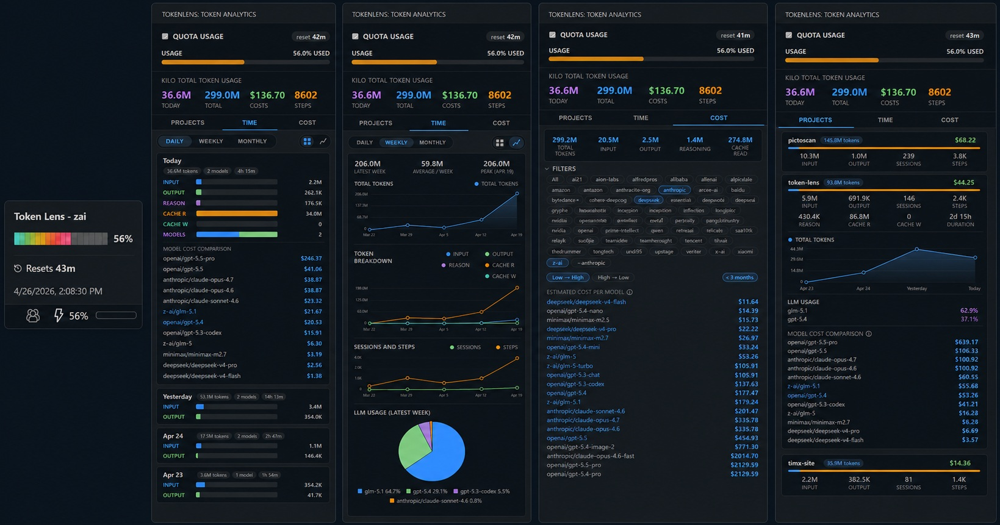

# Token Lens

  

**Master your LLM spend with usage insights tailored to your coding style.**

## Features

- **Status bar indicator** — color-coded usage at a glance (normal, warning ≥50%, error ≥80%)
- **Rich tooltip** — gradient usage bar, percentage, and time until quota reset
- **Hero stats** — today's tokens, total tokens, total cost, and total steps at the top of the sidebar
- **Interactive charts** — daily area/stacked charts for total tokens, token breakdown (input, output, reasoning, cache read, cache write), sessions & steps; per-project token trend charts
- **Sidebar analytics** — daily and per-project token breakdown with visual progress bars
- **Per-project & per-day model breakdown** — see which models were used and how much each cost
- **LLM cost comparison** — compare what your token usage would cost across models using live OpenRouter pricing, with provider filtering, sort direction, and age filters
- **Quota tracking** — monitors your z.ai quota
- **Configurable auto-refresh** — data updates automatically (default 5 minutes, customizable in settings)

## Supported Providers

- [z.ai](https://z.ai)

## Commands

| Command | Description |
|---|---|
| `TokenLens: Set API Key` | Enter your provider API key (stored securely in VS Code SecretStorage) |
| `TokenLens: Refresh` | Manually refresh token usage data |
| `TokenLens: Settings` | Open the settings panel (API key, refresh interval, database path) |

## Data Source

Token Lens reads usage data from the local Kilo SQLite database (`~/.local/share/kilo/kilo.db`) and your z.ai account quota via the z.ai API.

## Getting Started

1. Install the extension from the VS Code Marketplace
2. Open the Command Palette (`Ctrl+Shift+P` / `Cmd+Shift+P`)
3. Run **TokenLens: Set API Key** and paste your z.ai API key
4. Token usage appears in the status bar immediately
