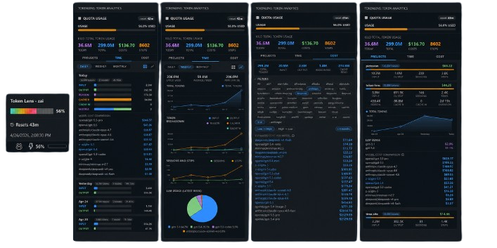

# Token Lens

  

**Never lose track of your LLM spend again.** Real-time token usage right in your status bar, with rich analytics one click away.

## Features

- **Status bar indicator** — color-coded usage at a glance (normal, warning ≥50%, error ≥80%)
- **Rich tooltip** — usage bar, percentage, and time until reset
- **Quota recovery** — keeps the last successful quota snapshot during transient API failures and shows stale/unavailable states explicitly
- **Sidebar analytics** — daily and per-project token breakdown
- **LLM cost comparison** — compare usage costs to understand model spend at a glance
- **Auto-refresh** — data updates every 5 minutes
- **Secure storage** — API key stored via VS Code's SecretStorage
- **Local timezone** — day grouping uses your local time, not UTC

## Supported Providers

- [z.ai](https://z.ai)

## Commands

| Command | Description |
|---|---|
| `TokenLens: Set API Key` | Enter your provider API key (stored securely) |
| `TokenLens: Refresh` | Manually refresh token usage data |

## Getting Started

1. Install the extension from the VS Code Marketplace
2. Open the Command Palette (`Ctrl+Shift+P` / `Cmd+Shift+P`)
3. Run **TokenLens: Set API Key** and paste your API key
4. Token usage appears in the status bar immediately
